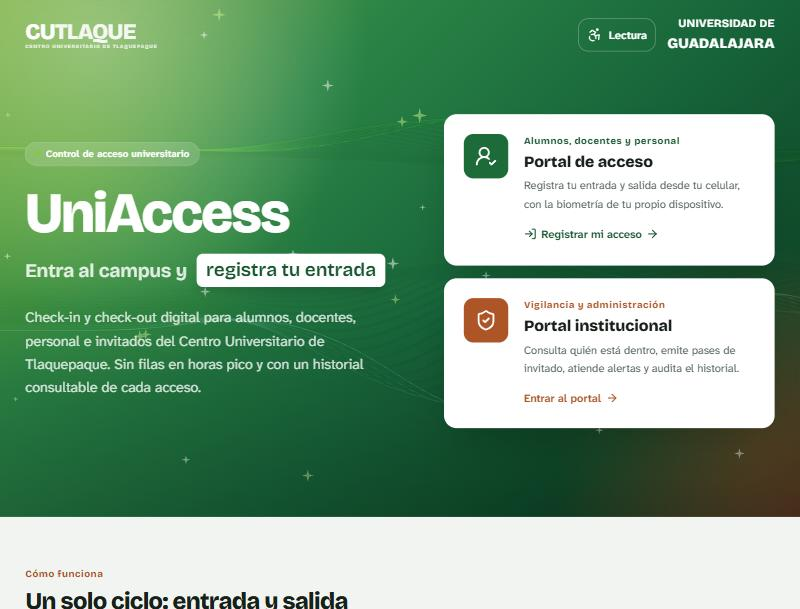
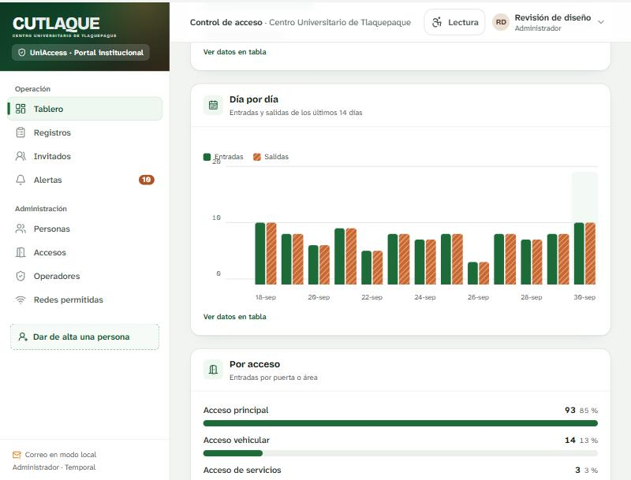
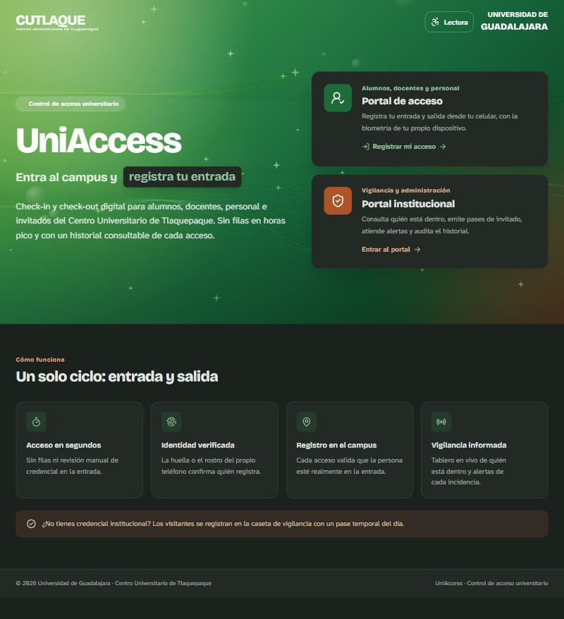

# UniAccess · CUTlaquepaque

> Control de entradas y salidas del Centro Universitario de Tlaquepaque **desde el celular de cada persona**, sin lectores ni torniquetes.


🇺🇸 [English version](README.en.md)

Proyecto de la materia **Seminario de Integración: Desarrollo** · 7.º semestre de Ingeniería en Informática.

<p align="center">
  
</p>

| Tablero con gráficas de afluencia | Modo oscuro |
| --- | --- |
|  |  |

---

## Contenido

- [El problema](#el-problema)
- [Qué hace](#qué-hace)
- [Inicio rápido](#inicio-rápido)
- [Probar la demo](#probar-la-demo)
- [Variables de entorno](#variables-de-entorno)
- [Arquitectura](#arquitectura)
- [Seguridad](#seguridad)
- [Privacidad de datos](#privacidad-de-datos)
- [Limitaciones conocidas](#limitaciones-conocidas)
- [Producción](#producción)
- [Documentación del proyecto](#documentación-del-proyecto)
- [Cómo contribuir](#cómo-contribuir)
- [Equipo](#equipo)
- [Licencia](#licencia)

---

## El problema

El centro universitario necesita saber **quién está dentro del campus** y llevar un historial de entradas y salidas de alumnos, docentes, personal e invitados, pero **no cuenta con hardware** (lectores de credencial o torniquetes) en sus accesos.

**Nuestra solución:** el celular de cada persona funciona como su credencial. La identidad se confirma con la **huella o el rostro del propio teléfono** (WebAuthn) y, opcionalmente, con una **geocerca** que valida que la persona esté junto al acceso.

El alcance completo, las historias de usuario con priorización MoSCoW y las reglas de negocio están en **[docs/ALCANCE.md](docs/ALCANCE.md)**.

---

## Qué hace

La plataforma tiene **dos portales separados**, cada uno con su propia sesión:

| Portal | Ruta | Quién entra | Cómo entra |
| --- | --- | --- | --- |
| Portal de acceso | `/acceso` | Alumnos, docentes y personal | Matrícula o correo institucional + contraseña, desde el celular |
| Portal institucional | `/control` | Vigilancia y administración | Correo institucional previamente registrado + contraseña |

### Portal de acceso (celular)
- **Entrada y salida** como acciones separadas, confirmadas con biometría del teléfono.
- **Geocerca opcional** por acceso: solo se registra estando cerca y con una ubicación precisa (±100 m o menos).
- **Red del campus opcional**: el registro puede limitarse al WiFi del campus.
- Un solo **dispositivo biométrico** por persona, con aviso por correo al vincularlo.
- Rechaza y **alerta a vigilancia** si la credencial venció, está dada de baja, el rol no puede usar ese acceso o la persona está fuera del área o de la red.
- Salida sin entrada previa: se registra y queda como **incidencia**. Salida repetida: avisa y no la duplica.
- Historial personal con filtros y descarga en CSV.

### Portal institucional
- **Tablero en vivo** de quién está dentro, con búsqueda y filtro por rol (se actualiza cada 15 s).
- **Gráficas de afluencia**: hoy hora por hora, día por día (7, 14 o 30 días), por tipo de persona, por acceso e intentos denegados. Cada gráfica se puede ver como tabla.
- **Pases de invitado** del día, con motivo y anfitrión.
- **Registro manual** de respaldo cuando el teléfono de la persona no puede registrar.
- **Alertas** de accesos denegados e incidencias.
- **Historial** con filtros y exportación a CSV.
- **Administración** de personas (con resumen gráfico), accesos (roles permitidos y geocerca), operadores y **redes permitidas** (WiFi del campus y computadoras de la caseta).

### Accesibilidad e inclusión
- Botón **Lectura** en todas las pantallas: tema claro u oscuro, tamaño de texto (normal, grande, muy grande) y animaciones (según el sistema, reducidas o completas).
- Tipografía **Atkinson Hyperlegible**, diseñada para personas con baja visión.
- Respeta "reducir movimiento" del sistema, foco visible al navegar con teclado y enlace para **saltar al contenido**.
- Los estados nunca dependen solo del color (llevan ícono y texto) y las gráficas usan colores probados para daltonismo, con rayado en la segunda serie.

### Roles
- Personas: `alumno`, `docente`, `personal`.
- Operadores: `vigilancia` (operación diaria) y `admin` (todo, incluida la administración).

---

## Inicio rápido

**Requisitos:** [Node.js 22.13 o superior](https://nodejs.org/) (incluye SQLite integrado; no hay que instalar base de datos).

```bash
# 1. Clona el repositorio
git clone https://github.com/DannNS20/BacklogDesarrollo.git
cd BacklogDesarrollo

# 2. Instala dependencias
npm install

# 3. Crea tu archivo de configuración
cp .env.example .env        # En Windows (PowerShell): Copy-Item .env.example .env

# 4. Edita .env y define al menos SEED_ADMIN_EMAIL y SEED_ADMIN_PASSWORD

# 5. Arranca la API y los portales
npm run dev
```

| Servicio | URL |
| --- | --- |
| Portales | http://localhost:5190 |
| API | http://localhost:4590 |

La primera vez, el servidor crea el **administrador inicial** con los datos de `.env` y tres accesos de ejemplo (principal, vehicular y de servicios).

### Scripts disponibles

| Comando | Qué hace |
| --- | --- |
| `npm run dev` | API + portales en modo desarrollo |
| `npm run build` | Compila los portales para producción |
| `npm start` | Servidor de producción (API + portales compilados) |
| `npm run typecheck` | Revisión de tipos con TypeScript |
| `npm run lint` | Revisión de estilo con oxlint |
| `npm test` | Pruebas automatizadas de las reglas de acceso (ver [casos de prueba](docs/CASOS_DE_PRUEBA.md)) |

---

## Probar la demo

1. En `.env`, pon `REQUIRE_BIOMETRIC=false` para poder registrar acceso desde una computadora sin huella.
2. Abre http://localhost:5190/control e inicia sesión con el administrador de `.env`.
3. En **Personas**, da de alta a un alumno. Necesitas:
   - matrícula de 6 a 10 dígitos,
   - correo institucional terminado en `udg.mx` (por ejemplo, `@alumnos.udg.mx`).

   La contraseña se genera automáticamente y **se muestra una sola vez**: cópiala.
4. Abre http://localhost:5190/acceso en otra ventana (o en tu celular) e inicia sesión con esa matrícula y contraseña.
5. Registra una **entrada** y revisa cómo aparece en el **tablero en vivo** del portal institucional.

> Para probar la biometría real en el celular se necesita HTTPS (ver [Producción](#producción)).

---

## Variables de entorno

Copia `.env.example` como `.env`. Las principales:

| Variable | Valor por defecto | Para qué sirve |
| --- | --- | --- |
| `API_PORT` | `4590` | Puerto de la API en desarrollo |
| `APP_ORIGIN` | `http://localhost:5190` | URL pública; la biometría queda ligada a este dominio |
| `REQUIRE_BIOMETRIC` | `true` | `false` permite registrar acceso sin biometría (demostraciones) |
| `ENFORCE_GEOFENCE` | `true` | `false` ignora la geocerca de los accesos |
| `SEED_ADMIN_EMAIL` | — | Correo del administrador inicial |
| `SEED_ADMIN_PASSWORD` | — | Contraseña del administrador inicial |
| `SEED_ADMIN_NAME` | `Administrador del sistema` | Nombre del administrador inicial |
| `SMTP_HOST`, `SMTP_PORT`, `SMTP_USER`, `SMTP_PASS`, `SMTP_FROM` | — | Correo saliente. Sin SMTP, los correos se guardan en `server/data/outbox` |
| `DATA_DIR` | `server/data` | Carpeta de la base de datos |

---

## Arquitectura

```
 Celular / navegador                     Servidor Node.js                    Datos
┌─────────────────────┐   HTTPS + JSON   ┌──────────────────────────┐      ┌──────────────┐
│ Portal de acceso    │ ───────────────▶ │ Express 5 + Zod          │ ───▶ │ SQLite       │
│ Portal institucional│ ◀─────────────── │ Sesiones · WebAuthn      │      │ (node:sqlite)│
│ React 19 + Vite     │                  │ Reglas de acceso         │      └──────────────┘
└─────────────────────┘                  └──────────────────────────┘
        │  huella / rostro (WebAuthn): nunca sale del teléfono
```

| Capa | Tecnología |
| --- | --- |
| Portales | React 19 + TypeScript + Vite + Tailwind CSS v4 + React Router |
| Animaciones | [React Bits](https://reactbits.dev) y Motion |
| API | Node.js + Express 5 + TypeScript (`tsx`) + Zod |
| Base de datos | SQLite integrado en Node (`node:sqlite`). El esquema es SQL estándar, migrable a PostgreSQL o SQL Server |
| Biometría | WebAuthn / passkeys con `@simplewebauthn`, verificadas en el servidor |
| Correo | Nodemailer (SMTP) |

### Estructura de carpetas

```
docs/ALCANCE.md         Historias de usuario, MoSCoW y reglas de negocio
shared/                 Contratos de datos y reglas compartidas por API y portales
server/src/
  db/                   Esquema SQL, conexión y datos iniciales
  lib/                  Contraseñas, sesiones, correo, límites, fechas
  middleware/           Autenticación por portal
  routes/               auth, person y staff/* (operación, personas, configuración)
  services/             Lógica de acceso, invitados, alertas y biometría
src/
  portals/Landing.tsx   Portada
  portals/person/       Portal de acceso (celular)
  portals/staff/        Portal institucional (vigilancia y administración)
  ui/  components/      Componentes reutilizables
```

---

## Seguridad

- Contraseñas con **scrypt** y sal aleatoria; solo la administración las genera y se muestran una sola vez.
- **Sesiones independientes por portal**, con cookies `HttpOnly` y `SameSite=Strict` guardadas con hash.
- Las bajas y los cambios de contraseña **cierran todas las sesiones** de esa cuenta.
- Límite de intentos de inicio de sesión.
- Validación de toda la entrada con Zod; las escrituras solo aceptan JSON.
- Biometría con desafío de un solo uso verificado en el servidor.
- Bitácora (`audit_log`) de altas, bajas, contraseñas, registros manuales y pases de invitado.

---

## Privacidad de datos

En apego a la *Ley Federal de Protección de Datos Personales en Posesión de los Particulares*:

| Dato | ¿Se guarda? | Para qué |
| --- | --- | --- |
| Nombre, matrícula, correo, rol | Sí | Identificar a la persona |
| Fecha y hora de entrada/salida | Sí | Historial de acceso |
| Ubicación al registrar (si hay geocerca) | Sí, en el registro | Validar que la persona estaba en el acceso |
| Huella o rostro | **No** | La verificación ocurre en el teléfono; el servidor solo recibe una firma |

<!-- TODO: enlazar el aviso de privacidad y definir cuánto tiempo se conservan los registros -->

---

## Limitaciones conocidas

Decisiones conscientes de esta versión. El detalle, la prioridad y la solución propuesta de cada una
están en el [registro de deuda técnica](docs/deuda-tecnica.md).

- **Reportes de afluencia** (historia 10): hay gráficas en el tablero, pero aún no reportes descargables por periodo para directivos.
- La **ubicación la reporta el teléfono**, por lo que puede falsificarse; la geocerca es una barrera, no una garantía. Por eso existe la restricción opcional por red del campus.
- La restricción por red depende de que el servidor vea la IP real: detrás de un proxy hay que configurar `trust proxy` en `server/src/index.ts`.
- El límite de intentos y los desafíos biométricos viven **en memoria**: se reinician si se reinicia el servidor y no funcionan con varias instancias.
- Sin integración con torniquetes, lectores de credencial ni el directorio institucional.
- Es una aplicación web, no una app nativa.

---

## Producción

```bash
npm run build
npm start
```

El mismo servidor entrega la API y los portales compilados.

- **HTTPS es obligatorio**: la biometría y la ubicación solo funcionan en conexiones seguras (o en `localhost`).
- Configura `APP_ORIGIN` con la URL pública exacta.
- Respalda `server/data/`, que contiene la base de datos.

---

## Documentación del proyecto

| Documento | Para quién | Qué responde |
| --- | --- | --- |
| Este README | Cualquier persona que llega al proyecto | ¿Qué hace y cómo lo instalo? |
| [docs/ALCANCE.md](docs/ALCANCE.md) | Equipo y docente | ¿Qué historias de usuario cubre y con qué reglas? |
| [docs/adr/](docs/adr/) | Equipo y quien llegue después | ¿Por qué hicimos esto y no lo otro? |
| [docs/deuda-tecnica.md](docs/deuda-tecnica.md) | Equipo | ¿Qué atajos tomamos y cómo los vamos a pagar? |
| [docs/CASOS_DE_PRUEBA.md](docs/CASOS_DE_PRUEBA.md) | Equipo y QA | ¿Cómo comprobamos que funciona? |

---

## Cómo contribuir

1. Haz un *fork* del repositorio y actualízalo con la rama `main` del equipo.
2. Crea una rama por cambio: `feat/…`, `fix/…` o `docs/…` (por ejemplo, `docs/readme`).
3. Escribe commits con [Conventional Commits](https://www.conventionalcommits.org/es/):
   `feat: agrega filtro por acceso`, `fix: evita salida duplicada`, `docs: actualiza README`.
4. Antes de subir, verifica que pasen `npm run typecheck` y `npm run lint`.
5. Abre un **Pull Request** hacia `main` describiendo qué cambió y cómo probarlo.
   Se necesita **al menos una revisión** de otro integrante para hacer *merge*.

---

## Equipo

<!-- TODO: completar con los integrantes -->

| Integrante | Rol en Scrum | GitHub |
| --- | --- | --- |
| Kevin Leonardo Perez Beltran | Product Owner | https://github.com/kevinperez357 |
| Manuel Osvaldo Montes Blancarte | Scrum Master | https://github.com/Blancarte-7655 |
| Alberto Lopez Sanchez | Desarrollo | https://github.com/BetoGDL51 |
| Fernando Daniel Serrano Islas | Desarrollo | https://github.com/DannNS20  |
| Marcos Karim Ramirez Medrano | Desarrollo | https://github.com/Markozrm |

---

## Licencia

Distribuido bajo la licencia MIT. Consulta [LICENSE](LICENSE). <!-- TODO: confirmar licencia con el equipo y agregar el archivo LICENSE -->